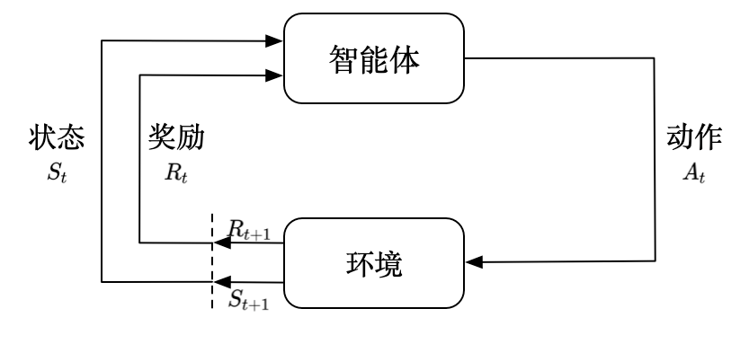
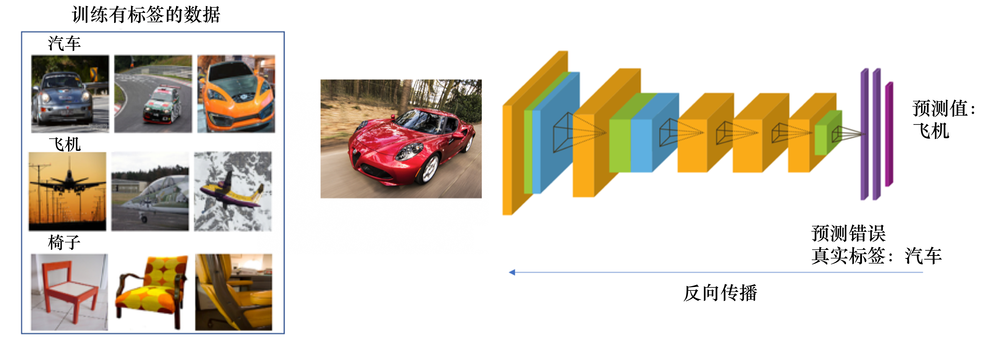
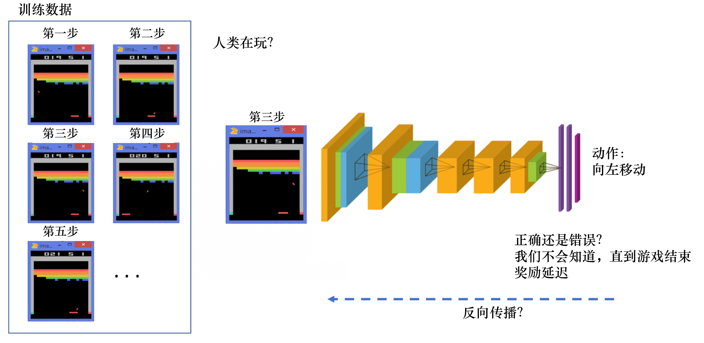
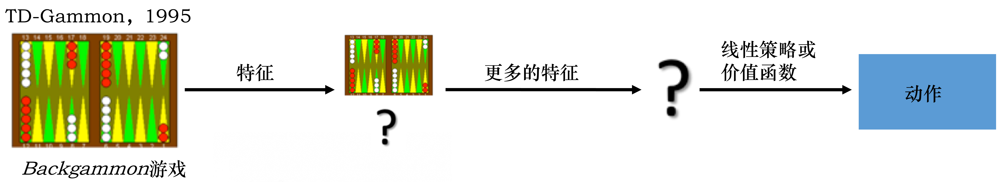

> Reinforcement learning is a framework for solving control tasks (also called decision problems) by building agents that learn from the environment by interacting with it through trial and error and receiving rewards (positive or negative) as unique feedback.
>
> 强化学习是一种解决控制问题（也称为决策问题）的框架。其核心思想是通过构建能够从环境中学习的人工智能 agent 来实现问题的解决。这些 agent 通过不断尝试与环境互动来学习，并依据获得的奖励（无论是正面的还是负面的反馈）来调整自己的行为。

# 1.1 强化学习与监督学习

**监督学习**假设拥有大量标注数据，且数据之间独立不相关，每个样本数据都来自一个相同的样本空间，且独立地从样本上采样获得，称为**独立同分布**，在神经网络训练过程中，我们需要将正确标注传递给神经网络，当其作出错误判断时，损失函数将通过反向传播完成训练。

1. 输入的数据（标注的数据）都应是没有关联的。因为如果输入的数据有关联，学习器（learner）是不好学习的。
2. 需要告诉学习器正确的标签是什么，这样它可以通过正确的标签来修正自己的预测。

**强化学习**无法满足**监督学习**的上述条件。

1. 对于每帧画面的输入，其为某个时间序列上的截断，前后之间有非常强烈的相关性。
2. 无法立刻获得反馈，某个动作往往需要长时间的验证才能判断是否正确，这样的**延迟奖励**问题使得神经网络训练困难。

强化学习和监督学习的区别如下：

1. 强化学习输入的样本是序列数据，而不像监督学习里面样本都是独立的。
2. 学习器不知道每一步正确的动作，学习器需要自己去发现哪些动作可以带来最多的奖励，只能通过不停地尝试来发现最有利的动作。
3. 智能体获得自己能力的过程，其实是不断地试错探索的过程。探索和利用是强化学习里面非常核心的问题。其中，探索指尝试一些新的动作，这些新的动作有可能会使我们得到更多的奖励，也有可能使我们“一无所有”；利用指采取已知的可以获得最多奖励的动作，重复执行这个动作，因为我们知道这样做可以获得一定的奖励。因此，我们需要在探索和利用之间进行权衡，这也是在监督学习里面没有的情况。
4. 在强化学习过程中，没有非常强的监督者，只有**奖励信号**，并且奖励信号是延迟的，即环境会在很久以后告诉我们之前我们采取的动作到底是不是有效的。因为我们没有得到即时反馈，所以智能体使用强化学习来学习就非常困难。当我们采取一个动作后，如果我们使用监督学习，我们就可以立刻获得一个指导，比如，我们现在采取了一个错误的动作，正确的动作应该是什么。而在强化学习里面，环境可能会告诉我们这个动作是错误的，但是它并没有告诉我们正确的动作是什么。而且更困难的是，它可能是在一两分钟过后告诉我们这个动作是错误的。所以这也是强化学习和监督学习不同的地方。

# 1.2 深度强化学习

强化学习是有一定的历史的，早期的强化学习，我们称其为标准强化学习。最近业界把强化学习与深度学习结合起来，就形成了深度强化学习。因此，深度强化学习 = 深度学习 + 强化学习。

我们可以把神经网络放到强化学习里面。

+ 标准强化学习：比如 TD-Gammon 玩 Backgammon 游戏的过程，其实就是设计特征，然后训练价值函数的过程，如图 1.10a 所示。标准强化学习先设计很多特征，这些特征可以描述现在整个状态。得到这些特征后，我们就可以通过训练一个分类网络或者分别训练一个价值估计函数来采取动作。
+ 深度强化学习：自从我们有了深度学习，有了神经网络，就可以把智能体玩游戏的过程改进成一个端到端训练（end-to-end training）的过程，如图 1.10b 所示。我们不需要设计特征，直接输入状态就可以输出动作。我们可以用一个神经网络来拟合价值函数或策略网络，省去特征工程（feature engineering）的过程。

