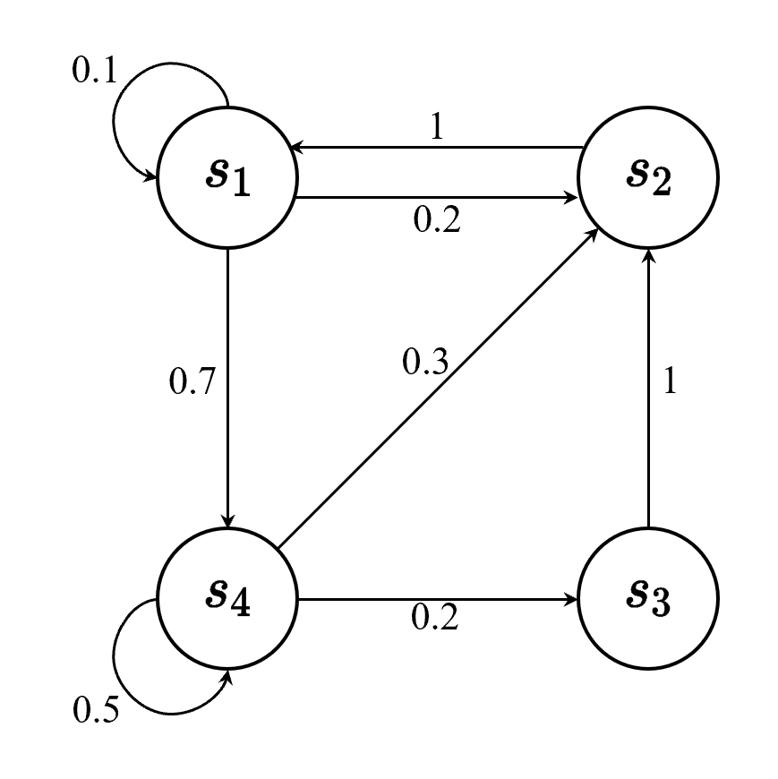

# 2 马尔科夫决策过程

> **马尔科夫过程(MP) → 马尔科夫奖励过程(MRP) → 马尔科夫决策过程(MDP)**

## 2.1 马尔科夫过程
### 2.1.1 马尔科夫性质

**马尔科夫**性质指的是一个随机过程在给定现在以及过去所有状态的情况下,未来状态的条件概率分布**仅依赖于当前状态**,而与过去所有状态无关,假设随机变量 $X_0,X_1\dots,X_T$ 构成一个随机过程,其所有可能取值被称为**状态空间**,如果 $X_{t+1}$ 的概率分布仅仅只与 $X_t$ 有关,即:

$$
p(X_{t+1}=x_{t+1}|X_{0:t}=x_{0:t})=p(X_{t+1}=x_{t+1}|X_t=x_t)
$$

如果一个过程满足马尔科夫性质,那么其**当前的转移与过去的转移独立，只取决于现在的状态**,需要注意的是,**马尔科夫性质不一定准确，只是一种近似的建模方式**

### 2.1.2 马尔科夫过程
马尔科夫过程是一组具有马尔科夫性质的随机变量序列 $s_1,\dots,s_t$。
其中下一个时刻的状态 $s_{t+1}$ 只取决于当前状态 $s_t$，假设状态历史为：

$$
h_t=\{s_1,s_2,\dots,s_t\}
$$

则马尔科夫过程满足条件：

$$
p(s_{t+1}|h_t)=p(s_{t+1}|s_t)
$$

离散时间下的马尔科夫过程也被称作 $\bbox[yellow]{马尔科夫链} $，如下图所示：
$s_1,s_2,s_3,s_4$ 四个状态相互转移。假设当前状态为 $s_1$,那么有 0.1 的概率保留在 $s_1$,有 0.2 的概率转移至 $s_2$,有 0.7 的概率转移至 $s_4$.可以用状态转移矩阵 $P$ 来描述上述马尔科夫过程：

$$
P=
\begin{pmatrix}
p(s_1|s_1)&p(s_2|s_1)&\dots&p(s_N|s_1)\\
p(s_1|s_2)&p(s_2|s_2)&\dots&p(s_N|s_2)\\
\vdots&\vdots&\ddots&\vdots\\
p(s_1|s_N)&p(s_2|s_N)&\cdots&p(s_N|s_N)
\end{pmatrix}
$$

当我们知道所在状态 $s_t$ 时，能够知道到达任意状态的概率。
$\bbox[yellow]{马尔科夫过程描述的是相邻时间关系上，同一个状态空间中不同状态相互转移的概率}$

## 2.2 马尔科夫奖励过程

**马尔科夫奖励过程**是马尔科夫链加上奖励函数的结果,在马尔科夫奖励过程中,其状态转移矩阵与状态和马尔科夫链一样

### 2.2.1 回报与价值函数

**范围(horizon)**:每个回合的最大时间步数

**回报(return)**:奖励的逐步叠加

假设时刻 $t$ 后的奖励序列为 $r_{t+1},r_{t+2},\dots,r_{t+T}$，则其**回报**可定义为：

$$
G_t=r_{t+1}+\gamma r_{t+2}+\gamma^2r_{t+3}+\gamma^3r_{t+4}+\dots+\gamma^{T-1}r_{t+T}
$$

其中，$T$ 为最终时刻，$\gamma$ 是**折扣因子**，$\bbox[yellow]{我们更希望考虑眼前环境,对于未来奖励要进行打折扣}$，定义**状态价值函数**为回报的期望：

$$
\begin{align}
V^t(s)&=\mathbb{E}[G_t|s_t=s]\\
&=\mathbb{E}[r_{t+1}+\gamma r_{t+2}+\gamma^2r_{t+3}+\dots+\gamma^{T-1}r_{t+T}|s_t=s]
\end{align}
$$

其中，$G_t$ 是上述定义的**折扣回报**，对 $G_t$ 取期望，代表从当前状态开始时刻,可能获得多大的价值。

**使用折扣因子的原因：**
1. 有些马尔科夫过程可能为环状结构，永远无法终结。必须对一定范围外的奖励进行遏制。
2. 我们无法建立一个完备的数学模型，或者说由于建模的误差，时间越远的奖励越没有参考意义。
3. 通过调整 $\gamma$ 的值，我们能够控制我们的奖励函数更着眼于现在还是未来。

### 2.2.2 贝尔曼方程
**一个状态的价值 = 当前立即获得的价值 + 未来获得价值的期望**

$$
V(s)=R(s)+\gamma\sum_{s'\in S}p(s'|s)V(s')
$$

其中：
1. $s$ 代表当前状态，$s'$ 代表未来所有可能状态
2. $p(s'|s)$ 代表从当前状态转移至未来某个状态的概率
3. $V(s)$ 代表当前状态价值，$v(s')$ 代表未来状态价值
4. $\gamma\mathop{\sum}_\limits{s' \in S}p(s'|s)V(s')$ 代表未来价值的期望乘以折扣因子

贝尔曼方程提供了一种当前状态价值与未来状态价值之间的转换关系。

**proof:**

---

**（1）全期望公式**

求条件期望的期望等价于直接求期望：

$$
E[X]=E[E(X|Y)]
$$

**proof:**

$$
\begin{aligned}
E[X|Y=y]&=\sum_x xp(X=x|Y=y)\\
E[E(X|Y)]&=\sum_y p(Y=y)E(X|Y=y)\\
&=\sum_y \sum_x xp(Y=y)p(X=x|Y=y)\\
&=\sum_y \sum_x xp(Y=y)\frac{p(X=x,Y=y)}{p(Y=y)}\\
&=\sum_x x\sum_y p(X=x,Y=y)\\
&=\sum_x xp(X=x)\\
&=E[x]
\end{aligned}
$$

注意：$E(X|Y)$ 本身是关于 $Y$ 的函数,当 $Y=y$ 确定，$E(X|Y)$ 退化为常数。
对状态价值求条件期望：

$$
\begin{aligned}
E[V(S_{t+1})|S_t=s_t]
&=E[E[G_{t+1}|S_{t+1}]|S_t=s_t]\\
&=E[\sum_{g_{t+1}}g_{t+1}p(G_{t+1}=g_{t+1}|S_{t+1})|S_t=s_t]\\
\end{aligned}
$$

记

$$
\sum_{g_{t+1}}g_{t+1}p(G_{t+1}=g_{t+1}|S_{t+1})
=f(S_{t+1})
$$

当随机变量 $S_{t+1}=s_{t+1}$，原期望退化为常数

$$
\begin{aligned}
上式&=E[f(S_{t+1})|S_t=s_t]\\
&=\sum_{s_{t+1}}f(S_{t+1}=s_{t+1})p(S_{t+1}=s_{t+1}|S_t=s_t)\\
&=\sum_{s_{t+1}}\sum_{g_{t+1}}g_{t+1}p(G_{t+1}=g_{t+1}|S_{t+1}=s_{t+1})p(S_{t+1}=s_{t+1}|S_t=s_t)
\end{aligned}
$$

由马尔科夫性质，可得

$$
p(G_{t+1}|S_{t+1})=p(G_{t+1}|S_{t+1},S_t)
$$

因为 $G_{t+1}$ 只与当前状态有关与过去状态无关

$$
\begin{aligned}
上式&=\sum_{s_{t+1}}\sum_{g_{t+1}}g_{t+1}p(G_{t+1}=g_{t+1}|S_{t+1}=s_{t+1},S_t=s_t)p(S_{t+1}=s_{t+1}|S_t=s_t)\\
&=\sum_{s_{t+1}}\sum_{g_{t+1}}g_{t+1}
\frac{p(G_{t+1}=g_{t+1},S_{t+1}=s_{t+1},S_t=s_t)}
{p(S_{t+1}=s_{t+1},S_t=s_t)}
\cdot
\frac{p(S_{t+1}=s_{t+1},S_t=s_t)}
{p(S_t=s_t)}\\
&=\sum_{s_{t+1}}\sum_{g_{t+1}}g_{t+1}
\frac{p(G_{t+1}=g_{t+1},S_{t+1}=s_{t+1},S_t=s_t)}
{p(S_t=s_t)}\\
&=\sum_{g_{t+1}}g_{t+1}
\sum_{s_{t+1}}
p(G_{t+1}=g_{t+1},S_{t+1}=s_{t+1}|S_t=s_t)\\
&=\sum_{g_{t+1}}g_{t+1}
p(G_{t+1}=g_{t+1}|S_t=s_t)\\
&=E[G_{t+1}|S_t=s_t]
\end{aligned}
$$

$\bbox[yellow]{conclusion:E[V(S_{t+1})|S_t=s_t]=E[G_{t+1}|S_t=s_t]}$

---

**（2）贝尔曼方程推导**

由（1）得到结论：$E[V(S_{t+1})|S_t=s_t]=E[G_{t+1}|S_t=s_t]$

$$
\begin{aligned}
V(S_t)&=E[G_t|S_t=s_t]\\
&=E[r_{t+1}+\gamma r_{t+2}+\gamma^2r_{t+3}+\dots+\gamma^{T-1}r_{t+T}|S_t=s_t]\\
&=E[r_{t+1}|S_t=s_t]+\gamma E[r_{t+2}+\gamma r_{t+3}+\dots+\gamma^{T-2}r_{t+T}|S_t=s_t]\\
&=R(S_t)+\gamma E[G_{t+1}|S_t=s_t]\\
&=R(S_t)+\gamma E[V(S_{t+1})|S_t=s_t]\\
&=R(S_t)+\gamma\sum_{s_{t+1}}V(S_{t+1}=s_{t+1})p(S_{t+1}=s_{t+1}|S_t=s_t)
\end{aligned}
$$

$t$ 时刻的状态价值
$=$ $t\rightarrow(t+1)$ 能获得回报期望（立即回报）
$+$ $(t+1)$ 时刻的所有可能的状态价值期望

---

**（3）解析解求法**

假设状态空间 $\mathbb{N}=\{s_1,s_2,\dots,s_N\}$,不妨将各个状态节点合并成矩阵形式：

$$
\begin{aligned}
\begin{pmatrix}
V(s_1)\\
V(s_2)\\
\vdots\\
V(s_N)
\end{pmatrix}
&=
\begin{pmatrix}
R(s_1)\\
R(s_2)\\
\vdots\\
R(s_N)
\end{pmatrix}
+
\gamma
\begin{pmatrix}
p(s_1|s_1)&p(s_2|s_1)&\cdots&p(s_N|s_1)\\
p(s_1|s_2)&p(s_2|s_2)&\cdots&p(s_N|s_2)\\
\vdots&\vdots&\ddots&\vdots\\
p(s_1|s_N)&p(s_2|s_N)&\cdots&p(s_N|s_N)
\end{pmatrix}
\begin{pmatrix}
V(s_1)\\
V(s_2)\\
\vdots\\
V(s_N)
\end{pmatrix}\\
\\
\mathbf{V}&=\mathbf{R}+\gamma\mathbf{P}\mathbf{V}\\
(\mathbf{I-\gamma\mathbf{P}})\mathbf{V}&=\mathbf{R}\\
\mathbf{V}&=\mathbf{(I-\gamma P)^{-1}R}
\end{aligned}
$$

拥有状态转移矩阵和各个状态的立即汇报期望，可以通过矩阵运算求出各个状态节点下的状态价值,但当解析解过大时，求解析解过于困难。

### 2.2.3 计算马尔科夫状态价值的迭代算法
当状态空间过于大时，往往采用迭代方法计算状态价值：
1. 蒙特卡洛
2. 动态规划
3. 时序差分（前两者的结合）

**（1）蒙特卡洛法**

$\bbox[yellow]{核心特点：无模型的采样估计方法}$
由于没有环境模型，没有办法确定两个状态之间的转移概率,也就没有办法知道状态转移矩阵，无法使用贝尔曼方程解析计算,既然有 $V(S_t=s_t)=E[G_t|S_t=s_t]$，一个状态处的价值只取决于其后续回报的期望,通过在状态点 $s_t$ 处不断出发，并累计回报 $G_t^{1}$，$G_t^{2},\cdots,G_t^N$,(实际上使用的是从任意状态起点出发，当经过 $s_t$ 时开始记录回报),认为其平均值能够近似拟合状态点 $s_t$ 的价值，即：

$$
V(S_t=s_t)\approx\frac{1}{N}\sum_{i=1}^NG^i_t（大数定律）
$$

一般采用迭代式的平均值计算方法：

$$
V_M=\frac{1}{M}\sum_{i=1}^{M}G^i_t
$$

$$
V_{M+1}
=\frac{1}{M+1}\sum^{M+1}_{i=1}G^i_t
=\frac{MV_M+G_t^{M+1}}{M+1}
=V_M+\frac{G_t^{M+1}-V_M}{M+1}
$$

**Pseudocode:**

$$
\boxed{
\begin{aligned}
&\textbf{输入:}策略\pi,\ 回合数N\\
&\textbf{初始化:}\\
&\qquad V(s)\leftarrow0,\quad Count(s)\leftarrow0,\quad \forall s\in S\\
&\mathbf{for}\ i=1\ \mathbf{to}\ N\\
&\qquad 按照策略\pi生成一条完整Episode\\
&\qquad \mathbf{for}\ t=T-1,T-2,\cdots,0\\
&\qquad\qquad G\leftarrow R_{t+1}+\gamma G\\
&\qquad\qquad \mathbf{if}\ S_t\ \text{第一次出现}\ \mathbf{then}\\
&\qquad\qquad\qquad Count(S_t)\leftarrow Count(S_t)+1\\
&\qquad\qquad\qquad V(S_t)\leftarrow V(S_t)+
\frac{G-V(S_t)}{Count(S_t)}\\
&\qquad\qquad \mathbf{end\ if}\\
&\qquad \mathbf{end\ for}\\
&\mathbf{end\ for}
\end{aligned}
}
$$

**（2）动态规划法**

$\bbox[yellow]{核心特点：拥有估计模型的自举更新方法}$
环境模型已知，根据贝尔曼方程，当前状态价值函数可以表示为立即回报期望与未来所有可能状态价值期望,由于模型已知，所以每个状态下的状态价值函数都是唯一确定的,对每一个时刻的状态进行暴力迭代逼近结果可以了。

**Pseudocode:**

$$
\boxed{
\begin{aligned}
&\textbf{输入:}环境模型p,\text{折扣因子}\gamma\\
&\textbf{初始化:}\\
&\qquad V(s)\leftarrow0,V'(s)\leftarrow0,\forall s \in S\\
&\mathbf{while\ }\lVert V'(s)-V(s)\rVert>\epsilon\\
&\qquad\Delta\leftarrow0\\
&\qquad\mathbf{for\ each\ }s\in S\\
&\qquad\qquad V'(s)\leftarrow V(s)\\
&\qquad\qquad V(s)\leftarrow R(s)+\gamma\sum_{s'}V(s')p(s'|s)\\
&\qquad\qquad \Delta\leftarrow \max{(\Delta, \lvert V(s)-V'(s) \rvert)}\\
&\mathbf{end\ while}
\end{aligned}
}
$$

## 2.3 马尔科夫决策过程

和马尔科夫奖励过程的不同点在于,马尔科夫决策过程不仅取决于智能体当前状态,也取决于智能体的动作,其马尔科夫性质满足:

$$
p(s_{t+1}|s_t,a_t)=p(s_{t+1}|h_t,a_t)
$$

同样的,其即时奖励也和所选择的动作有关 $R(S_t=s_t,A_t=a_t)=\mathbb{E}[r_t|S_t=s_t,A_t=a_t]$.

### 2.3.1 马尔科夫决策过程中的策略

策略和动作是捆绑的概念,策略决定了当前状态采取各个动作的概率,也就是$\bbox[yellow]{策略是一个状态的函数,因变量为某个动作的概率,即:}$

$$
\pi(a_t|s_t)=p(A_t=a_t|S_t=s_t)
$$

确定具体的马尔科夫决策过程和策略 $\pi$ 后,马尔科夫决策过程就能退化成为马尔科夫奖励过程,马尔科夫奖励过程需要的是状态转移矩阵 $p(s_{t+1}|s_t)$,已知则是马尔科夫奖励过程中的 $p(s_{t+1}|s_t,a_t)$, 则:

$$
\begin{align}
p_\pi(s_{t+1}|s_t)&=\frac{p(s_{t+1},s_t)}{p(s_t)}\\
&=\sum_{a_t \in A}\frac{p(s_{t+1},s_t,a_t)}{p(s_t)}\\
&=\sum_{a_t \in A}\frac{p(s_{t+1},s_t,a_t)}{p(s_t,a_t)}\frac{p(s_t,a_t)}{p(s_t)}\\
&=\sum_{a_t \in A}\pi(a_t|s_t)p(s_{t+1}|s_t,a_t)
\end{align}
$$

同理,对于立即奖励,也可以退化:

$$
r_\pi(s_t)=\sum_{a_t \in A}\pi(a_t|s_t)R(s_t, a_t)
$$

### 2.3.3 马尔科夫决策与马尔科夫奖励的区别

从**马尔科夫链->马尔科夫奖励->马尔科夫决策**是循序渐进的过程,马尔科夫链利用**前后状态之间的转移概率**,而马尔科夫奖励则在马尔科夫链上加上了**奖励机制**用以筛选最好的状态转移路径,但是奖励确定+转移矩阵确定,则各个状态上的评分也确定了,所以**马尔科夫奖励**只是在求那个确定的价值评分和最优的路径
主要的问题在于,**当奖励机制+状态转移矩阵都是确定的->最优的状态转移路径也确定**,假设状态转移矩阵 $p_1$ 得到最优状态转移路径 $c_1$,状态转移矩阵 $p_2$ 得到最优状态转移路径 $c_2$,但是 $c_1$ 和 $c_2$ 之间仍然有优劣之分,即使他们各自都是自己条件下的最有路径.
想象一下一个机器人在走迷宫,机器人a在面前的至多三个路口中随机选择一个,机器人b永远贴着右手前进,每走一步我们都惩罚他减少一分,**在这样一种奖励和状态转移矩阵都是确定的情况中,这两种策略很明显的能够影响对应的最优路径**,假设只是一个带有环的简单迷宫,那么b机器人永远无法走出去,即使他永远走在最优路径上.
有点类似于**全局最优**和**局部最优**的概念,所以,应当不断调整**状态转移矩阵**,这也顺水推舟引出了策略的概念了,**所谓策略,就是通过引入动作的概念,不断调整状态转移矩阵**,而且通过策略这个概念,能在交流时更加清晰,我们可以说"你的机器人用的什么策略,会做哪些动作"而不是"你的机器人使用的什么状态转移矩阵"这样束之高阁的概念,我们只需要规定好**某个状态通过某个动作变成另一个状态的概率=世界运行规则**,然后将策略和动作作为我们的优化目标就行了

### 2.3.3 马尔科夫决策过程与状态价值函数

类似于马尔科夫决策过程中,定义状态价值函数:

$$
V_\pi(s_t)=\mathbb{E}[G_t|S_t=s_t]
$$

可以知道,当策略确定后,各个状态的价值也就确定了,引入**Q函数/动作价值函数**来和动作建立关系:

$$
Q_\pi(s_t,a_t)=\mathbb{E}[G_t|S_t=s_t,A_t=a_t]
$$

不难发现动作价值函数和状态价值函数的关系:

$$
V_\pi(s_t)=\sum_{a_t\in A}\pi(A_t=a_t|S_t=s_t)Q_\pi(s_t,a_t)
$$

对Q函数的贝尔曼方程进行推导:

$$
\begin{align}
Q(s_t,a_t)&=\mathbb{E}[G_t|s_t,a_t]
\\&=\mathbb{E}[r_{t+1}+\gamma r_{t+2}+\gamma^2r_{t+3}+\cdots|s_t,a_t]
\\&=\mathbb{E}[r_{t+1}|s_t,a_t]+\gamma\mathbb{E}[r_{t+2}+\gamma r_{t+3}|s_t,a_t]
\\&=R(s_t,a_t)+\gamma\mathbb{E}[G_{t+1}|s_t,a_t]
\\&=R(s_t,a_t)+\gamma\mathbb{E}[V(S_{t+1})|s_t,a_t](全期望公式)
\\&=R(s_t,a_t)+\gamma\sum_{s_{t+1} \in S}p(s_{t+1}|s_t,a_t)V(s_{t+1})
\end{align}
$$

### 2.3.4 总结

定义式:

$$
V_\pi(s_t)=\mathbb{E}[G_t|s_t]\\
Q_\pi(s_t,a_t)=\mathbb{E}[G_t|s_t,a_t]\\
$$

价值函数与动作价值函数的关系:

$$
\boxed{V_\pi(s_t)=\sum_{a_t \in A}\pi(a_t|s_t)Q_\pi(s_t,a_t)}
$$

Q函数的贝尔曼方程:

$$
\boxed{Q_\pi(s_t,a_t)=R(s_t,a_t)+\gamma\sum_{s_{t+1}}p(s_{t+1}|s_t,a_t)V_\pi(s_{t+1})}
$$

将V函数或者Q函数替换,可以得到纯V函数或者纯Q的贝尔曼方程:

$$
\boxed{Q_\pi(s_t,a_t)=R(s_t,a_t)+\gamma\sum_{s_{t+1}}p(s_{t+1}|s_t,a_t)\sum_{a_t\in A}\pi(a_{t+1}|s_{t+1})Q_\pi(s_{t+1},a_{t+1})}
$$
$$
\boxed{V_\pi(s_t)=\sum_{a_t\in A}\pi(a_t|s_t)\big( R(s_t,a_t)+\gamma\sum_{s_{t+1}}p(s_{t+1}|s_t,a_t)V_\pi(s_{t+1})\big)}
$$

### 2.3.4 预测与控制

**预测是指给定一个马尔科夫决策过程<S,A,P,R,$\gamma$>和策略$\pi$,计算各个状态下的价值函数**
**控制指的是输入一个马尔科夫决策过程<S,A,P,R,$\gamma$>和,输出一个最佳价值函数$V^*$和最佳策略$\pi^*$**

这两者是无法剥离的关系,预测是在已知策略的情况下计算状态价值,控制是寻找最优策略,**预测能够计算状态价值,而控制能够判断当前策略是否最优,并将迭代的策略再次交给预测进行计算**

### 2.3.5 马尔科夫决策过程控制

**最佳价值函数**:这样一种策略,使得每个状态的状态价值能有最大值

$$
V^*(s)=\max_\pi V_\pi(s)
$$

**最佳策略**:使得各个状态达到最大值的策略,可能有多个最佳策略使得状态价值的最大值一致最大

$$
\pi^*(s)=\mathop{\arg\max}_\pi V_\pi(s)
$$

当得到 $V^*(s)$ 后,各个状态下的价值已经确定,当然Q函数也是确定的,最佳策略与动作有关,所以要查看Q函数,当某个动作能使得Q函数有最大值时,这个动作就是当前状态下的最优动作,也就是最优策略,即:

$$
\pi^*(a_t|s_t)=\begin{cases}
    1, \quad a_t = \mathop{\arg\max} Q^*(s,a)\\
    0,\qquad 其他
\end{cases}
$$

怎么样对策略进行优化,穷举显然太低效了,常用方法有两种:**策略迭代和价值迭代**
马尔科夫决策过程控制就是给定一个决策过程,寻找一个最佳策略和对应的最佳价值

### 2.3.6 策略迭代

策略迭代由两个步骤组成:**策略评估和策略改进**

1. 策略评估:在优化过程中得到一个新的策略,利用该策略估计新的状态价值函数

$$
V_{\pi_k}(s_t)=\sum_{a_t\in A}\pi_k(a_t|s_t)[R(s_t,a_t)+\gamma\sum_{a_t\in A}p(s_{t+1}|s_t,a_t)V_{\pi_k}(s_{t+1})]
$$

2. 策略改进:得到状态价值函数后,计算各个状态下的Q函数,然后利用**贪心**对各个状态下Q最大化,改进策略

$$
\pi_{k+1}(s_t)=\mathop{\arg\max}_{a_t}[R(s_t,a_t)+\gamma\sum_{a_t\in A}p(s_{t+1}|s_t,a_t)V_{\pi_k}(s_{t+1})]
A   $$

可以将Q函数看作一个**Q-table**,横轴是对应的状态,纵轴是所有可能的动作,当每次的策略评估完毕后,在每个状态中选取使得Q函数最大的那个动作作为下一次迭代的策略

### 2.3.7 价值迭代

**贝尔曼最优方程**:在最优策略下,状态的动作等于使得Q函数最大的动作:

$$
\pi^*(a_t|s_t)=\begin{cases}
    1, \quad a_t = \mathop{\arg\max} Q^*(s_t,a)\\
    0,\qquad 其他
\end{cases}
$$

由V函数的定义:

$$
V(s_t)=\sum_{a\in A}\pi(a_t|s_t)Q(s_{t+1}|s_t,a_t)
$$

由于只有Q值最大的那个动作概率为1,其余为0,所以相当于选出最大的Q值:

$$
\boxed{V^*(s_t)=\max_{a_t}Q^*(s_t,a_t)}
$$

参考[Q函数的贝尔曼方程有](#234-总结):

$$
\boxed{Q^*(s_t,a_t)=R(s_t,a_t)+\gamma\sum_{s_{t+1}\in S}p(s_{t+1}|s_t,a_t)V^*(s_{t+1})}
$$

同理可以替换为纯Q函数的方程与纯V函数的方程:

$$
\boxed{Q^*(s_t,a_t)=R(s_t,a_t)+\gamma\sum_{s_{t+1}\in S}p(s_{t+1}|s_t,a_t)\max_{a_{t+1}}Q^*(s_{t+1},a_{t+1})}
$$
$$
\begin{aligned}
V^*(s_t)&=\max_{a_t}Q^*(s_t,a_t)
\\&=\boxed{\max_{a_t}\big(R(s_t,a_t)+\gamma\sum_{s_{t+1}\in S}p(s_{t+1}|s_t,a_t)V^*(s_{t+1}\big)}
\end{aligned}
$$

也就是说给出一个<S,A,P,R,$\gamma$>,这个马尔科夫决策的V*是确定的,价值迭代算法通过上述贝尔曼最优方程进行更新:

$$
\boxed{V(s_t)\leftarrow \max_{a_t}\big(R(s_t,a_t)+\gamma\sum_{s_{t+1}\in S}p(s_{t+1}|s_t,a_t)V(s_{t+1})\big)}
$$

### 2.3.8 马尔科夫决策过程总结

功能 | 贝尔曼方程 | 算法 | 
----|----|----|
预测|贝尔曼方程|动态规划/蒙特卡洛
控制|贝尔曼方程|策略迭代
控制|贝尔曼最优方程|价值迭代

