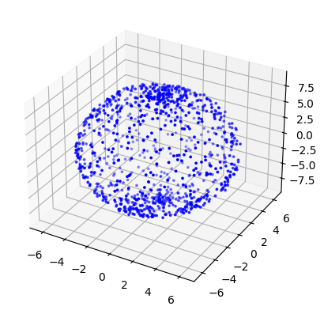
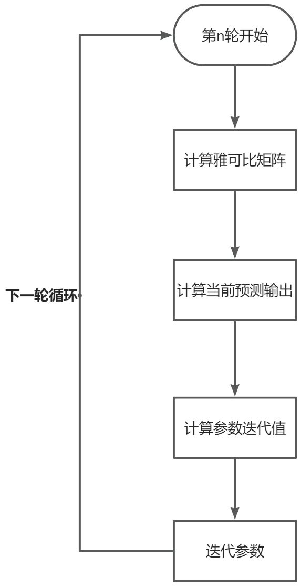
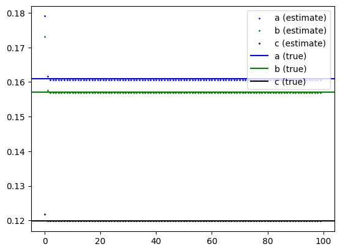

# 线性最小二乘

## 解决问题

存在多组观测值 $(x_i,y_i)$ $(i=1,2\cdots,m)$。
采用 $n$ 次多项式进行拟合 $h_\theta(x)=\theta_0+\theta_1x+\theta_2x^2+\cdots\theta_nx^n$。
最小二乘法就是寻找一组 $\theta$ 使得 $\Sigma^n_{i=1}(h_\theta(x_i)-y_i)^2$ 残差平方和最小。
即求：

$$
\min\Sigma^n_{i=1}(h_\theta(x_i)-y_i)^2
$$

## 矩阵解法

有矩阵表达式：

$$
h_\theta(x)=X\theta
$$

其中：

$$
X=
\begin{bmatrix}
1 & x_0 & x^2_0 & \cdots & x^n_0\\
1 & x_1 & x^2_1 & \cdots & x^n_1\\
\vdots & \vdots & \vdots & \ddots & \vdots\\
1 & x_m & x^2_m & \cdots & x^n_m
\end{bmatrix}
$$

$$
\theta=
\begin{bmatrix}
\theta_0\\
\theta_1\\
\vdots\\
\theta_n
\end{bmatrix},
\qquad
Y=
\begin{bmatrix}
y_0\\
y_1\\
\vdots\\
y_m
\end{bmatrix}
$$

定义损失函数为：

$$
J(\theta)=\frac{1}{2}(X\theta-Y)^T(X\theta-Y)
$$

对 $\theta$ 求偏导有：

$$
\frac{\partial}{\partial\theta}J(\theta)=X^T(X\theta-Y)=0
$$

得到：

$$
\theta=(X^TX)^{-1}X^TY
$$

在下面非线性最小二乘的基础上，所谓的 $X$ 矩阵实际上也就是模型函数 $h_\theta(x)$ 的雅可比矩阵 $J$，所以形式和非线性下的 $(J^TJ)^{-1}J^T$ 是一样的。

# 非线性最小二乘

## 解决问题

同样考虑多组观测值 $(x_i,y_i)$ $(i=1,2,\cdots,m)$。
由于非线性无法用矩阵描述，假设已知模型函数 $\hat{y}=f(x,\beta)$。
既与观测样本又与模型参数 $\beta=(\beta_1,\beta_2,\cdots,\beta_n)$ 有关。
目标是找到与观测值拟合最好的参数 $\beta$，即最小化残差平方和：

$$
S=\sum_{i=1}^mr_i^2
$$

由于非线性，无法书写成矩阵乘积形式，残差 $r_i$ 的定义为：

$$
r_i=y_i-f(x_i,\beta)
\qquad (i=1,2,\cdots,m)
$$

$S$ 取最小值时梯度为零，可得到 $n$ 个参数的梯度方程：

$$
\frac{\partial S}{\partial\beta_j}
=
-2\sum_{i=1}^{m}r_i
\frac{\partial r_i}{\partial\beta_j}
=0
\qquad (j=1,2,\cdots,n)
$$

## 高斯-牛顿算法

$\frac{\partial r_i}{\partial\beta_j}$ 是关于 $\beta$ 的函数，通常没有解析解，需要通过初始值迭代求解。

$$
\beta_j\approx\beta_j^{k+1}=\beta_j^k+\Delta\beta_j
$$

其中，$k$ 是迭代次数，$\Delta\beta$ 是偏移向量，每次迭代时，使用一阶泰勒展开线性化模型：

$$
\begin{aligned}
f(x_i,\beta)
&\approx
f(x_i,\beta^k)
+\sum_{j=1}^n
\left.
\frac{\partial f(x,\beta)}{\partial\beta_j}
\right|_{x=x_i,\beta=\beta^k}
(\beta_j-\beta_j^k)\\
&=
f(x_i,\beta^k)
+\sum_{j=1}^nJ_{ij}\Delta\beta_j
\end{aligned}
$$

其中 $J$ 代表模型函数关于模型参数的 $m\times n$ 雅可比矩阵：

$$
J=
\begin{bmatrix}
\left.\dfrac{\partial f(x,\beta)}{\partial\beta_1}\right|_{x=x_1,\beta=\beta^k}
&
\cdots
&
\left.\dfrac{\partial f(x,\beta)}{\partial\beta_n}\right|_{x=x_1,\beta=\beta^k}
\\
\vdots
&
\ddots
&
\vdots
\\
\left.\dfrac{\partial f(x,\beta)}{\partial\beta_1}\right|_{x=x_m,\beta=\beta^k}
&
\cdots
&
\left.\dfrac{\partial f(x,\beta)}{\partial\beta_n}\right|_{x=x_m,\beta=\beta^k}
\end{bmatrix}
$$

观察不免得到：

$$
\frac{\partial r_i}{\partial\beta_j}=-J_{ij}
$$

记：

$$
\Delta y_i^k=y_i-f(x_i,\beta^k)
$$

$$
\begin{aligned}
r_i
&=y_i-f(x_i,\beta)\\
&=(y_i-f(x_i,\beta^k))+(f(x_i,\beta^k)-f(x_i,\beta))\\
&\approx\Delta y_i^k-\sum_{s=1}^nJ_{is}\Delta\beta_s
\end{aligned}
$$

其中 $\beta^k$ 为由初始值迭代而来的当前参数值，是常数。$\beta$ 为自变量。
通过巧妙的函数构建，将前半部分构造为当前迭代下的预测误差 $\Delta y_i^k$ 为可计算的常数。
后半部分通过泰勒展开为关于 $\Delta\beta$ 的函数，将 $\Delta y_i^k$ 与 $\Delta\beta$ 联系起来。
代入梯度方程有：

$$
2\sum_{i=1}^mJ_{ij}
\left(
\Delta y_i^k-\sum_{s=1}^nJ_{is}\Delta\beta_s
\right)=0
$$

$$
\sum_{i=1}^m\sum_{s=1}^nJ_{ij}J_{is}\Delta\beta_s
=
\sum_{i=1}^mJ_{ij}\Delta y_i^k
$$

对于 $n$ 维参数，这样的方程可以联立成方程组，称为正规方程：

$$
\sum_{i=1}^m\sum_{s=1}^nJ_{ij}J_{is}\Delta\beta_s
=
\sum_{i=1}^mJ_{ij}\Delta y_i^k
\qquad (j=1,\cdots,n)
$$

可用矩阵表示为：

$$
J^TJ\Delta\beta=J^T\Delta y^k
$$

## 代码示例
随机生成椭球面 $a^2x^2+b^2y^2+c^2z^2-1=0$ 上的点。

依据椭球方程：

$$
x=\frac{\sin(\phi)\sin(\theta)}{a},
\qquad
y=\frac{\sin(\phi)\cos(\theta)}{b},
\qquad
z=\frac{\cos(\phi)}{c}
$$

进行采样，并给点坐标添加噪声 $\epsilon\sim\mathcal{N}(0,0.1^2)$。

```python
a, b, c= np.random.uniform(1e-6, 1, 3)
xyz = []
for _ in range(1000):
    phi = np.random.uniform(0, np.pi)
    theta = np.random.uniform(0, 2 * np.pi)
    noise = np.random.normal(0, 0.1)
    x = np.sin(phi)*np.sin(theta)/a+noise
    noise = np.random.normal(0, 0.1)
    y = np.sin(phi)*np.cos(theta)/b+noise
    noise = np.random.normal(0, 0.1)
    z = np.cos(phi)/c+noise
    xyz.append([x, y, z])
	
fig = plt.figure()
ax = fig.add_subplot(111, projection='3d')
ax.scatter([row[0] for row in xyz], [row[1] for row in xyz], [row[2] for row in xyz], s=3, c='blue')
plt.show()
```



得到随机1000个椭球采样点,在每个round内,选取batch个数据,并通过以下流程完成运算。



```python
# h = a^2 * x^2 + b^2 * y^2 + c^2 * z^2 - 1
# dhda = 2a * x^2
# dhdb = 2b * y^2
# dhdc = 2c * y^2

# 通过公式计算雅可比矩阵
def diff(guess, xyz):
	dhda = 2 * guess.item(0) * (xyz[0] ** 2)
	dhdb = 2 * guess.item(1) * (xyz[1] ** 2)
	dhdc = 2 * guess.item(2) * (xyz[2] ** 2)
	return [dhda, dhdb, dhdc]

# 通过当前预测参数进行计算
def makeAGuess(guess, xyz):
	result = guess.item(0)**2 * xyz[0] ** 2 + \
	guess.item(1)**2 * xyz[1] ** 2 + \
	guess.item(2)**2 * xyz[2] ** 2 - 1
	return result

guess = np.array([[0.1], [0.1], [0.1]])
batches = 100
rounds = 100
modify_guess = []
for r in range(rounds):
	J = []
	guess_z = []
	real_z = []
	random.shuffle(xyz)
	for _ in range(batches):
		J.append(diff(guess, xyz[_]))
		guess_z.append([makeAGuess(guess, xyz[_])])
		real_z.append([0])
	J = np.array(J)
	guess_z = np.array(guess_z)
	real_z = np.array(real_z)
	delta_z = real_z - guess_z
	delta_guess = np.linalg.pinv(J) @ delta_z
	guess += delta_guess
	modify_guess.append(guess.copy())
```



# 最小二乘与最大似然估计的关系

当假设**高斯噪声**存在时，对于概率的最大似然估计可以**等效于**对于残差的最小二乘法
更泛地说，最小二乘法更像一个**已知模型与参数关系**的问题（但也可以计算似然估计）
最大似然估计更像一个**已知概率分布与参数关系**的问题，而且在某些情况下是无法通过概率分布转换成模型的，譬如对于扔骰子我们只能知道其分布但无法推断其模型
对于模型：

$$
y_i=f(x_i;\theta)+\epsilon_i
$$

假设噪声符合高斯噪声且独立均值为 $0$

$$
\epsilon_i\sim\mathcal{N}(0,\sigma^2)
$$

可以认为观测值

$$
y_i\sim\mathcal{N}(f(x_i;\theta),\sigma^2)
$$

所以对于单个观测值 $y_i$ 有似然

$$
L(\theta|y_i)
=
p(y_i|\theta)
=
\frac{1}{\sqrt{2\pi\sigma^2}}
\exp\left(
-\frac{(y_i-(f(x_i;\theta))^2}{2\sigma^2}
\right)
$$

对于 $m$ 组观测数据有联合概率

$$
L(\theta)
=
\prod_{i=1}^{m}L(\theta|y_i)
=
\prod_{i=1}^{m}
\frac{1}{\sqrt{2\pi\sigma^2}}
\exp\left(
-\frac{(y_i-(f(x_i;\theta))^2}{2\sigma^2}
\right)
$$

由于存在指数，不妨对齐求对数最大化

$$
\max_\theta \log{L(\theta)}
=
-C_1\sum_{i=1}^m(y_i-f(x_i;\theta))^2+C_2,
\qquad C_1>0
$$

$$
\max_\theta\log L(\theta)
\iff
\min_\theta\sum_{i=1}^m(y_i-f(x_i;\theta))^2
$$

也即最小二乘法的原理

$$
\begin{array}{ll}
\boldsymbol{噪声分布}&\boldsymbol{对应优化}\\
\hline
\text{高斯分布}&\text{最小二乘}\\
\text{拉普拉斯分布}&\text{最小绝对值}\\
\text{均匀分布}&\text{最大误差最小}
\end{array}
$$